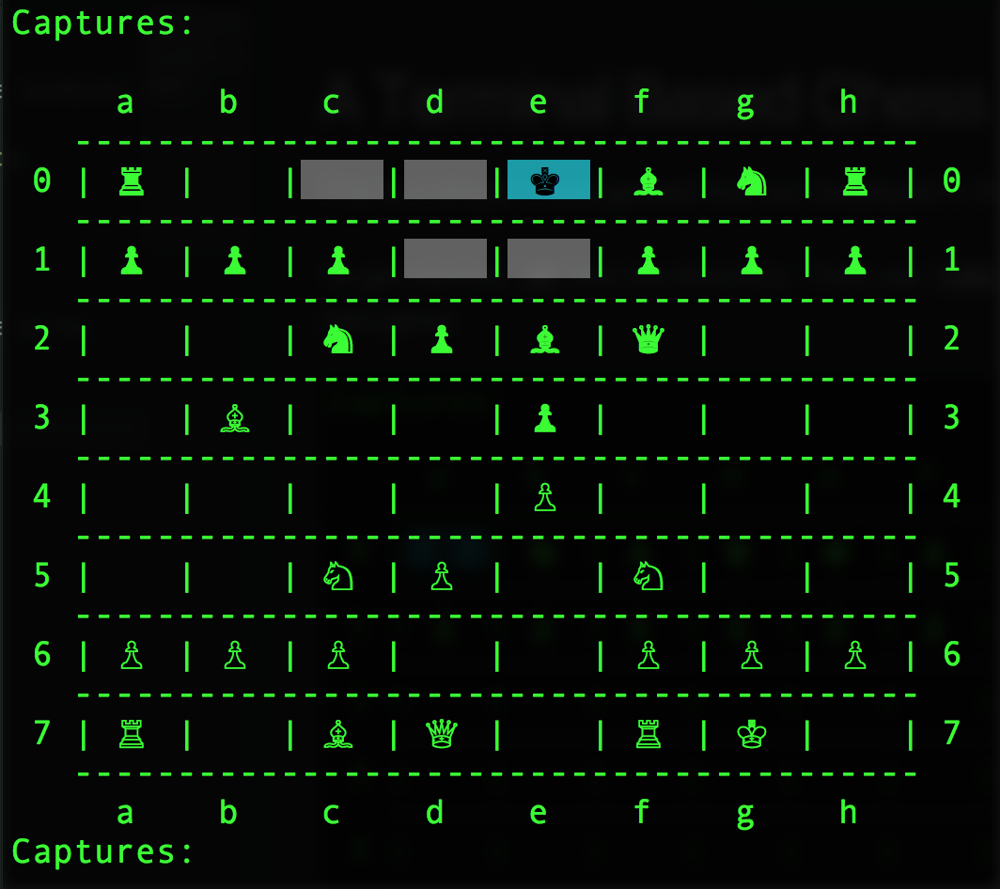

## A Terminal Based Chess Game

This is a simple chess game that can be played in the terminal.

To get started, `cd` into the directory. Then use the command `ruby game.rb` in the terminal to start a new game.

  

Use `space` or `return` to select a piece, and use the arrow keys to select a destination.

### Current Features
- Supports two human players
- Supports king castle
- Show captured pieces
- Highlight possible movies
- Highlight selected piece

_More features to come..._